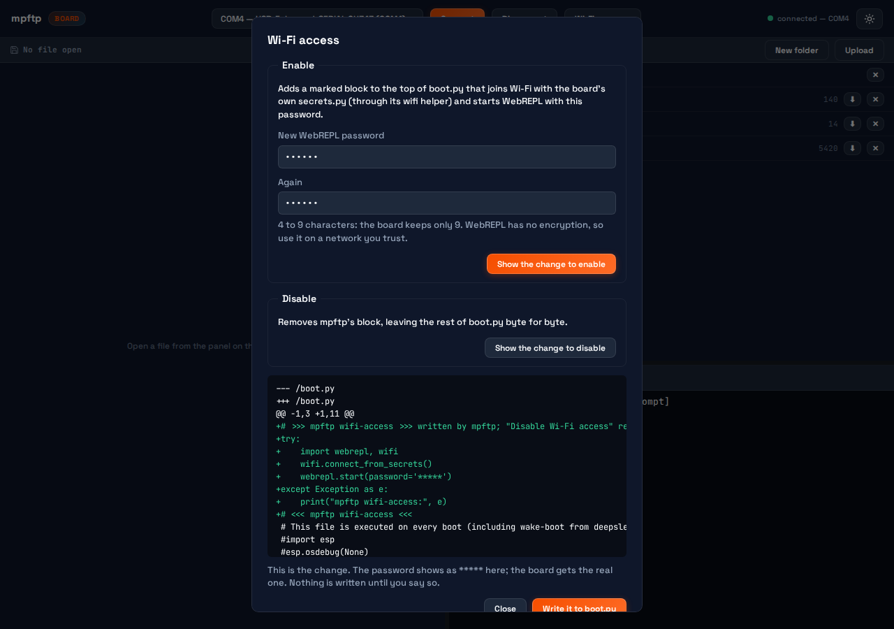
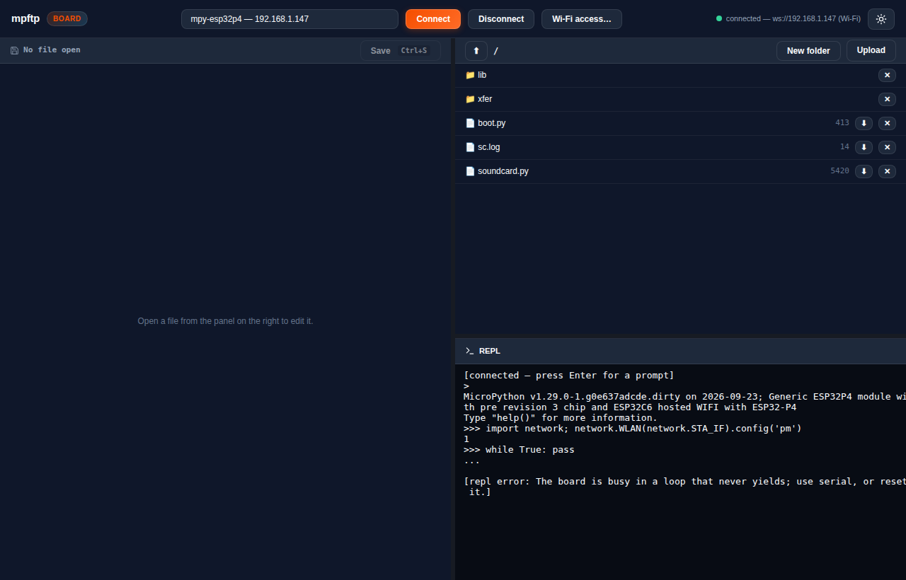

# mpftp over Wi-Fi (WebREPL)

Status: phase 2 done. Wi-Fi is a choice in the VS Code extension's Connect
list, the PWA's board list and the CLI, and all three can set a board up for it.

## What you can do

Connect over USB and choose **Enable Wi-Fi access** (VS Code: **mpftp: Enable
Wi-Fi Access**; the PWA: **Wi-Fi access…**; the CLI: `mpftp wifi enable -d
COM4`). You pick a WebREPL password, mpftp shows the exact change to `boot.py`,
and nothing is written until you say yes. From then on the board joins your
network at every reset, and the next time you pick a board, it's in the list
under **Wi-Fi** by name. **Disable Wi-Fi access** takes the block out again and
leaves `boot.py` byte for byte as it was.



The CLI takes a WebREPL address wherever it takes a serial port:

```bash
mpftp wifi boards                          # boards mpftp has seen with Wi-Fi up
mpftp wifi find mpy-esp32p4                # NAME.local by mDNS, best effort
mpftp exec -d ws://192.168.1.147 "print('hello')"
mpftp put -r -d ws://192.168.1.147 lib /lib
mpftp get -r -d ws://192.168.1.147 /lib ./lib-copy
```

The port defaults to 8266. Serial devices behave exactly as before.

`mount` is serial-only (see [below](#mount-is-serial-only)). The REPL, file
transfer, run, exec and resets all work over Wi-Fi.

## The five decisions (Brad, 2026-09-24)

What phase 1 left open, as Brad decided it, and what each became.

1. **Passwords: one per board, in secret storage.** The extension keeps them in
   VS Code's SecretStorage, keyed by the board's `machine.unique_id()` (or by
   the address until the first connect tells it the id). The CLI and the PWA
   have no secret store, so they keep them in `~/.mpftp/webrepl-passwords.json`,
   created with mode 0600. That file is plaintext on disk: anyone who can read
   your home directory can read it. Every UI says WebREPL keeps at most 9
   characters and refuses a longer one; a password mpftp writes to a board is
   4 to 9 characters, upstream `webrepl_setup`'s rule. The phase-1
   `MPFTP_WEBREPL_PASSWORD` / `webreplPassword` still works as a fallback. No
   password reaches a log or an RPC reply.
2. **boot.py: offered, with your OK.** Over a serial connection, Enable puts a
   block between `# >>> mpftp wifi-access >>>` and `# <<< mpftp wifi-access
   <<<` at the top of `boot.py`. It imports the board's `wifi` helper, calls
   `wifi.connect_from_secrets()` (the board reads its own `secrets.py`; mpftp
   only checks one exists, and never reads it), then `webrepl.start()` with
   your password. You see the diff first, with the password shown as `*****`,
   and mpftp refuses to write if `boot.py` changed after you looked. Missing
   pieces (no helper, no `secrets.py`, no `webrepl`) are explained instead of
   written. Top of the file, so an error further down can't cost you Wi-Fi
   access, and so Disable gives back the original bytes. If mpftp created
   `boot.py`, Disable deletes it.
3. **Power save: off during transfers only.** Before a transfer over Wi-Fi the
   sidecar reads `WLAN(STA_IF).config('pm')`, sets `PM_NONE`, and afterwards
   puts back exactly the value it read, in a `finally`, so an error or cancel
   restores it too. It doesn't touch power save if `bluetooth.BLE().active()`
   (ESP-IDF needs modem sleep for Wi-Fi/BLE coexistence), or over serial. A
   UI's batch of uploads is one change (`transfer_begin` / `transfer_end`), not
   one per file. If the connection drops mid-transfer the error says power
   save stays off until the board resets, and the next transfer in the session
   restores the saved value rather than the "off" it would read.
4. **Discovery: remember, type, mDNS.** Every connect reads the board's uid,
   hostname and, when Wi-Fi is up, its IP. A serial connect to a board with
   Wi-Fi up records it under `wifiBoards` in `~/.mpftp/config.json`, and the
   Connect lists offer those boards by hostname. You can also type an address,
   or a `NAME.local` that mpftp looks up by mDNS. The look-up asks the OS
   resolver first, then sends its own query (`cli/src/mpftp/mdns.py`, standard
   library only). The UIs run it in the sidecar, which on WSL is Windows Python.
5. **A loop that never yields: say so.** Over WebREPL, a program that never
   sleeps blocks Ctrl-C and new connections, because the esp32 port only
   services its sockets from `MICROPY_EVENT_POLL_HOOK` (a firmware patch is
   coming separately). mpftp now says "The board is busy in a loop that never
   yields; use serial, or reset it." in three places: when Ctrl-C (the
   Interrupt command, or Ctrl-C typed in a REPL) gets no answer in 2.5 s; when
   a connect to a board that logged in earlier this session stops answering;
   and when a connect gets no answer from a host that still answers ping. A
   busy board still answers ping, because lwIP runs in its own task, so a board
   that's switched off still gets the plain "no answer" message.

## Proved on the P4 (2026-09-23)

The Waveshare ESP32-P4 panel on COM4, through the PWA server's WebSocket
(the calls its UI makes) and by clicking the PWA in Playwright:

- Enable over serial showed the diff above; the board was then hard-reset.
- The board was found again at `ws://192.168.1.147` from the remembered list,
  and by mDNS: `mpy-esp32p4.local` resolved in 0.19 s from Windows Python,
  through the system resolver. From WSL (mirrored networking) neither the OS
  resolver nor mpftp's own query got an answer; a query sent straight to the
  board's port 5353 did, which is the reply the unit tests parse.
- Connected over Wi-Fi with no password in the request (the server supplied
  the saved one), and the REPL answered `print(6*7, 'over wifi')` with `42 over
  wifi`.
- `put -r` then `get -r` of 7 files (55 KB) verified every SHA-256 on the
  board, and the host copies matched. Power save read `1` before, was `0`
  during each transfer, and read `1` after.
- `while True: pass`, then Ctrl-C, gave the busy-loop message in the REPL, from
  the Interrupt call and on reconnect. A fresh CLI process with no session
  memory said the same, from the ping check. A serial connect recovered it.
- Disable showed its diff, and `boot.py` hashed back to
  `0155a2cd…faaa41`, the value before Enable. After a hard reset Wi-Fi was off
  and WebREPL was not running.



The VS Code side (Connect list, SecretStorage, the diff editor and the modal
confirmation) typechecks and uses the same sidecar calls the PWA run exercised,
but nobody has clicked through it in VS Code yet.

## Mount is serial-only

`mpremote mount` works over WebREPL but is unusable. Every file the board opens
under `/remote` goes through the REPL stream a byte at a time: listing a
two-file directory took 7.9 s, importing a one-line module 6.3 s, and reading a
27 KB file never finished. `mount` over Wi-Fi now refuses with that reason.

## Password handling on the wire

The CLI and the PWA server look the password up on your side and pass it to
the sidecar in the `connect` call, because a Windows sidecar spawned from WSL
can't see your Linux environment or home directory. The extension does the
same from SecretStorage. The sidecar keeps it in memory for reconnects. The
activity log redacts it. It never goes in the address: `ws://:pw@host` is
refused.

WebREPL has no TLS. The password and everything after it cross your network in
the clear, so use it on a network you trust.

## The design, and why

[`cli/src/mpftp/webrepl.py`](../../cli/src/mpftp/webrepl.py) has a small
WebSocket client written with only the standard library, `WebSocketSerial`.
It has the pyserial surface that mpremote's `SerialTransport` uses (`read`,
`write`, `inWaiting`, `timeout`). A subclass of `SerialTransport` is handed that
object instead of a COM port, so raw REPL, exec, and every `fs_*` operation
mpremote and the sidecar already use work unchanged. The only third-party
packages are mpremote and pyserial, which the sidecar already needed.

Out of the box, that was far slower than serial. Four measured changes fixed
it:

1. **Force the ACK the board waits for.** lwIP on the board writes a frame's
   2-byte header and its payload as two sends. Nagle holds the payload until the
   header is ACKed, and Windows delays that ACK by up to 200 ms. When the client
   sees a header without its payload, it sends an empty pong, which carries the
   ACK. Every reply stalled for 200 ms before that.
2. **Plain raw REPL, not raw-paste.** Raw-paste gives the host a 128-byte
   window, so every 128 bytes costs a Wi-Fi round trip: a 4 KB script took
   5–6 s. TCP already provides the flow control raw-paste exists for, so the
   command goes in one write.
3. **Uploads use WebREPL's binary PUT.** mpremote uploads by exec'ing
   `f.write(b'...')` in 256-byte chunks. The board reads REPL input a byte at
   a time through `dupterm`, at about 3 KB/s, which came to 0.2–0.9 KB/s. That
   was slower than serial. The PUT frames are read 512 bytes at a time instead.
   A PUT the board can't open raises inside its REPL input path and ends the
   session, so mpftp opens the file with an exec first. A failed flash write
   inside PUT is ignored on the board (`assert(0)` is compiled out), so mpftp
   checks the size afterwards.
4. **Downloads are streamed, not printed.** Printed output is mirrored to the
   board's UART console and runs at its speed (1–3 KB/s). An exec wraps
   `webrepl.client_s` in a second `websocket` object in binary mode, and the
   file goes out in 4 KB binary frames. WebREPL's own GET waits for an ACK
   every 256 bytes and managed 2.7–3.4 KB/s. If `webrepl.client_s` isn't
   there, mpftp falls back to mpremote's printed read.

Two things were tried and left out:

- **TCP_NODELAY on the board's socket.** It took the median exec from 96 to
  22 ms. It also starved a program that prints in a loop: under 1 KB arrived
  in 8 s, against 81 KB without it. A user's program matters more.
- **WebREPL GET**, for the ACK-per-chunk reason above.

## Measured on the P4 (Waveshare ESP32-P4 panel, C6 over ESP-Hosted)

These numbers come from Windows `python.exe`, the way the sidecar runs. RSSI was
-67 to -80.

| | serial COM4 | Wi-Fi |
|---|---|---|
| `exec` output | identical | identical |
| median exec round trip | 20 ms | 20–95 ms (varies with the link) |
| one 128 KB file, put / get | 2.7 / 2.8 KB/s | 45–51 / 48–204 KB/s |
| 20 files, 240 KB incl. a 150 KB binary, `put -r` / `get -r` | 2.7 / 2.8 KB/s | 7.0 / 9.2 KB/s (power save off), 3.9 / 6.4 KB/s (power save on) |

The directory round trip checks each upload's SHA-256 on the board, and all 20
downloaded files matched their sources. With 20 files, the per-file round trips
cost more than moving the bytes does, so the directory figure tracks Wi-Fi
latency. The board's default Wi-Fi power save (`pm=1`) put the average ping at
170–180 ms. `pm=PM_NONE` brought it to 39–51 ms.

Interrupt and reset:

- **Ctrl-C** stops a loop that sleeps or waits in 0.06–0.22 s.
- **A loop that never sleeps can't be interrupted over WebREPL.** That covers a
  bare `while True: n += 1`, and a loop that only prints. It also stops the board
  answering a new WebREPL connection. The ESP32 port polls sockets only in
  `MICROPY_EVENT_POLL_HOOK`, which a busy loop never reaches, so this is a
  firmware limit. Serial or a hard reset still works.
- **`soft-reset`** does a raw soft reset, which frees WebREPL's socket, then
  reconnects. That took 7.2 s including `boot.py` restarting WebREPL. The state
  is gone and `main.py` is skipped.
- **`soft-reboot`** leaves `main.py` running and ends the session. `resume`
  reconnects, and reconnecting interrupts `main.py`.
- **Connect doesn't soft-reset over Wi-Fi.** It interrupts only, so the VM keeps
  its state. A reset would kill the connection being made.

Failures:

- A wrong password fails in 1.2 s with "the board rejected the WebREPL
  password", and it isn't retried.
- A missing password fails at once.
- An address with no board on it fails in 5 s.
- A second client gets "Another WebREPL client may be connected".
